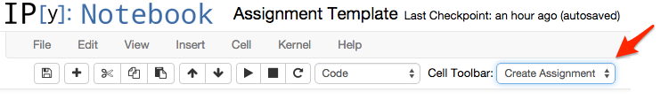
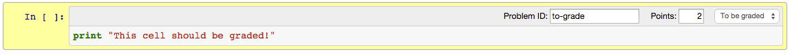

# The assignment toolbar

nbgrader includes an extension to the notebook interface that allows
cells to be marked for grading.

## Installation

To install the toolbar, run the following commands on the command
line:

```
curl -L https://rawgithub.com/jhamrick/nbgrader/master/nbgrader/assignment_toolbar.js > $(ipython locate)/nbextensions/assignment.js
curl -L https://rawgithub.com/jhamrick/nbgrader/master/nbgrader/assignment_toolbar.css > $(ipython locate)/nbextensions/assignment.css
```

Then, edit your `custom.js` (found in `$(ipython locate
profile)/static/custom/custom.js`) to include the following:

```javascript
$([IPython.events]).on('app_initialized.NotebookApp', function() {
    require(["nbextensions/assignment"], function (assignment) {
        console.log('Assignment extension loaded');
        assignment.register(IPython.notebook);
    });
});
```

## Usage

Once the toolbar has been installed, you should see it in the drop
down "Cell toolbar" menu:



Selecting the "Create Assignment" toolbar will create a separate
toolbar for each cell. By default, this consists of a single drop down
menu with a default value of "-". Other values include:

* "To be graded" -- mark the cell as part of the assignment that
  students must complete, and which will be graded when they turn it
  in.
* "Release only" -- this cell should only be included in the release
  version of the assignment.
* "Solution only" -- this cell should only be included in the solution
  version of the assignment.
* "Skip" -- this cell should not be included in either the release
  version or or the solution version of the assignment.

If you select "To be graded" for a cell, it has two additional effects:

* The area around the cell will turn yellow, making it more visible to
  instructors and to students.
* A text box labeled "Points" will appear. In this, you can mark how
  many points this part of the assignment is worth.

Here is an example "To be graded" cell:


