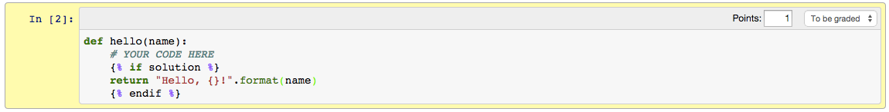

# Release and solution versions

Often, instructors will want to create a *release* version of an
assignment, and a *solutions* version -- one which will be given to
students to complete, and one which will be given out only after
students have submitted their completed assignments. This creates a
problem for instructors who want to keep the release version and the
solution version synchronized.

One remedy for this problem is to have one master version -- a
"template" version -- which is then converted to either a release
version or a solution version.

## Master Version

The "master version" is just a standard IPython notebook. By default,
everything in the master version will go in both the release version
and in the solutions version.

There are two ways to mark something for "release only" or "solution
only":

* Using the [assignment toolbar](assignment-toolbar.md), mark whole
cells as "Release only" or "Solution only".

* Using templates, mark *parts* of cells as only for release or only
for solution. A template will typically look like this:

```python

# solution text/code goes here
# (any number of lines is fine)

# whatever default text/code or prompt you want to display in the
# release version goes here

```

Here is an example of such a template in action (note that the `` clause is not required -- if it is excluded, then nothing
will be included in the release version):



The release version will look like this:

```python
def hello(name):
    # YOUR CODE HERE
```

And the solution version will look like this:

```python
def hello(name):
    # YOUR CODE HERE
    return "Hello, {}!".format(name)
```

### Working with templates

When developing your assignment, you probably want to be working with
the solutions, so you know that they are correct. Unfortunately, the
templates make that difficult because they are not valid Python
syntax. To resolve this, you can use the `%render_template_as` magic,
which takes a single argument of either `solution` or `release`. It
will then treat template cells accordingly as if they were either for
the solution or the release version, allowing them to be run. To use
the magic, create and run a cell with the following:

```python
%load_ext nbgrader
%render_template_as <mode>
```

Where `<mode>` should be either `solution` or `release`. You may also
want to mark that cell as "Skip", so that it is not included in the
release or solution version of the assignment.

## nbconvert configuration

To convert the master version into either a release version or a
solution version, you must use nbconvert. The easiest way to do this
is to create a file called `ipython_nbconvert_config.py` in the same
directory as your assignment notebook. The simplest example would look
something like this:

```python
c = get_config()
c.NbConvertApp.export_format = 'notebook'
c.NbConvertApp.writer_class = 'nbgrader.AssignmentWriter'
c.Exporter.preprocessors = ['nbgrader.AssignmentPreprocessor']
```

Which tells nbconvert to convert to notebook format, to write out the
converted file using `AssignmentWriter` from nbgrader, and to use the
`AssignmentPreprocessor` from nbgrader. Then, you would use two different
command line invocations to get either the release version or the
solution version.

### Release version

At the command line, run:

```bash
ipython nbconvert master.ipynb --output=release.ipynb --AssignmentPreprocessor.solution=False
```

This will convert the `master.ipynb` notebook to a new notebook called
`release.ipynb`.

### Solution version

At the command line, run:

```bash
ipython nbconvert master.ipynb --output=solution.ipynb --AssignmentPreprocessor.solution=True
```

This will convert the `master.ipynb` notebook to a new notebook called
`solution.ipynb`.

## Conversion options

### Assignment preprocessor

The `AssignmentPreprocessor` offers several conversion options that you
may find useful:

* `AssignmentPreprocessor.solution` -- boolean, whether a release version
  should be produced, or a solution version
* `AssignmentPreprocessor.header` -- path to a "header" notebook, whose
  cells will be inserted at the beginning of the assignment. These
  cells will be also processed like the master notebook cells, so you
  can still mark them as solution/release only and use templates.
* `AssignmentPreprocessor.footer` -- path to a "footer" notebook, whose
  cells will be appended to the end of the assignment. Like the
  header, hese cells will be also processed like the master notebook
  cells, so you can still mark them as solution/release only and use
  templates.
* `AssignmentPreprocessor.title` -- the title of the assignment, which
  can be used as a template variable name (see below).
* `AssignmentPreprocessor.disable_toolbar` -- disable the
  [assignment toolbar](assignment-toolbar.md) in the release and
  solution versions, so that students cannot (easily) edit the
  assignment's metadata.

These options can be specified on the command line, or in the
`ipython_nbconvert_config.py` configuration file.

### Assignment writer

The `AssignmentWriter` also offers conversion options that you may
find useful:

* `AssignmentWriter.build_director` -- where to save the outputted
  files to. This can be useful if converting multiple notebooks at
  once (e.g., for an assignment in which each notebook corresponds to
  a different problem).
* `AssignmentWriter.files` -- files that the notebook(s) depend on
  (e.g. images)
* `AssignmentWriter.save_rubric` -- whether to save out a JSON file
  with information about the different parts of the problem and how
  much each is worth.
* `AssignmentWriter.rubric_file` -- the name of the file to which the
  rubric should be saved, not including the ".json" extension.

These options can be specified on the command line, or in the
`ipython_nbconvert_config.py` configuration file.

### Template variables

Additionally, there are some handy templating variables that you can
insert into any markdown cell in your document. The syntax them for
them is `{{ variable_name }}`.

* `toc` -- a table of contents for the assignment, based on heading
  cells.
* `title` -- the title of the assignment, as specified by
  `AssignmentPreprocessor.title`.
